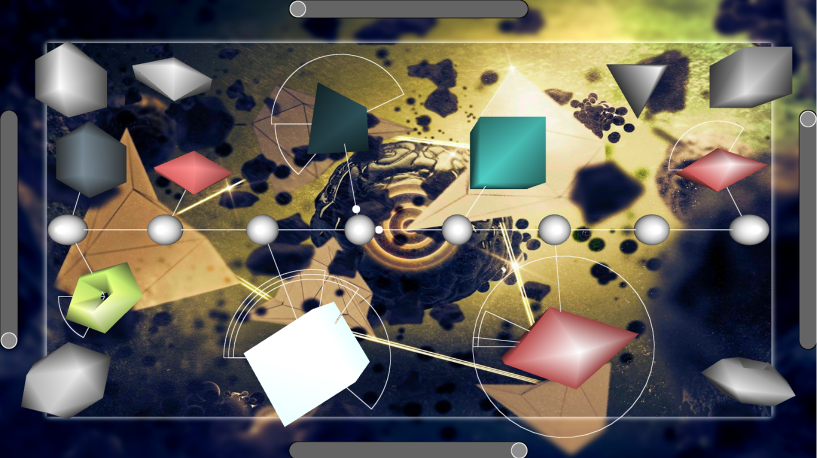

# TreeQuencer - Collaborative Rhythm Sequencing 

")

This is the original source code for the prototypical rhythm sequencing application in the 
publication:

Klügel, Niklas, Gerhard Hagerer, and Georg Groh. "TreeQuencer: Collaborative Rhythm Sequencing-A Comparative Study"

Abstract:
In this contribution we will show three prototypical applications that allow users to collaboratively create rhythmic structures with successively more degrees of freedom to generate rhythmic complexity. By means of a user study we analyze the impact of this on the users’ satisfaction and further compare it to data logged during the experiments that allow us to measure the rhythmic complexity created.

which can be found here: http://nime2014.org/proceedings/papers/498_paper.pdf

The TreeQuencer project itself consists of three prototypes that offer slightly different sequencing, you can select the respective prototype in Settings.txt , check the publication for further details about their differences.
It is originally a tabletop application but the framework also allows use with mouse input apart from TUIO and native win7 touch.

Dependencies:
- reakt: https://github.com/lodsb/reakt
- UltraCom: https://github.com/lodsb/UltraCom

- checkout and build + sbt publish for each of these

- The real-time audio synthesis uses SuperCollider / ScalaCollider, therefore an additional SuperCollider installation is necessary.

